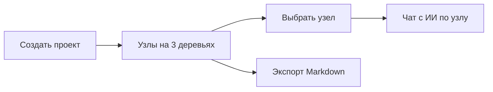

# Ship Sai 1.0

## Контекст и принцип

База — уже работающий `versions/sai_0_0_5`. Разведка показала: резать почти нечего, инфраструктура (Redis / Hocuspocus / BullMQ / Stripe) **не требуется для старта**, auth уже заглушён под локального пользователя, канвас работает через tRPC без Yjs. Работа недели — **поднять, закрыть 3 дыры, выпустить**.

Жёсткие правила (из `SHIP.md`): ТЗ заморожено, скоуп заморожен, любая мысль «можно лучше» → в `LATER.md`, не в работу. Судья готовности — посторонний человек, не автор.

## Единственный сквозной путь (определение готово)

Посторонний человек открывает собранное приложение и сам проходит: создал проект → накидал узлы на 3 деревьях → поговорил с ИИ **по конкретному узлу** → выгрузил Markdown. Прошёл — релиз готов.

## Что закрываем (3 дыры)

- AI-чат: `GlobalChat` сейчас уровня проекта; `nodeId` принимается в `/api/ai/stream`, но игнорируется. Надо пробросить выбранный узел в системный промпт и в UI.
- Экспорт Markdown: backend синхронный и рабочий, но в UI нет кнопки.
- Загрузка: `prisma db push` требует pgvector — решается docker-образом `pgvector/pgvector:pg16` без правки схемы.

## Что НЕ трогаем (уже не мешает / в LATER)

Redis, Hocuspocus/Yjs, BullMQ-воркеры, Stripe, email, share, snapshots, hypotheses, PDF/PNG, мульти-провайдерный свитчер. При `SAI_MODE=selfhost` лимиты и биллинг — no-op. BYOK-wizard оставляем как есть (ключ настраивается один раз в `/settings/keys`).

## Ключевые файлы для правок

- Node chat (UI): [src/components/canvas/project-workspace.tsx](versions/sai_0_0_5/src/components/canvas/project-workspace.tsx) — прокинуть `selectedNodeId` из `useCanvasStore` в чат
- Node chat (запрос): [src/components/chat/global-chat.tsx](versions/sai_0_0_5/src/components/chat/global-chat.tsx) — добавить `nodeId` в тело POST
- Node chat (контекст): [src/app/api/ai/stream/route.ts](versions/sai_0_0_5/src/app/api/ai/stream/route.ts) — при `nodeId` загрузить узел и добавить в system prompt
- Кнопка экспорта: [src/components/canvas/project-workspace.tsx](versions/sai_0_0_5/src/components/canvas/project-workspace.tsx) — download-ссылка на `/api/export/[projectId]?format=md`
- Экспорт backend (проверить): [src/lib/exporters/markdown.ts](versions/sai_0_0_5/src/lib/exporters/markdown.ts), [src/app/api/export/[projectId]/route.ts](versions/sai_0_0_5/src/app/api/export/[projectId]/route.ts)

## План на 7 дней

- День 1 (16.06): публичный пост с датой; поднять локально (pgvector docker + `.env` + `db push` + `npm run dev`), пройти путь руками
- День 2 (17.06): подтвердить старт без Redis/collab/worker; урезать `docker-compose` до одного postgres; убедиться, что billing/лимиты no-op
- День 3 (18.06): чистый путь «создать проект → канвас» single-user (при необходимости захардкодить workspaceId вместо cookie)
- День 4 (19.06): чат по узлу — проброс `nodeId` в UI и system prompt, проверка что отвечает в контексте узла
- День 5 (20.06): кнопка «Экспорт Markdown» в header проекта + проверка вывода (включая узлы без иерархии)
- День 6 (21.06): тест посторонним, чинить только блокеры пути
- День 7 (22–23.06): простейший деплой/запуск + показать свидетелю публично

## Критерии приёмки

1. Приложение стартует одной командой без Redis/Hocuspocus/BullMQ.
2. Посторонний проходит весь путь без помощи автора.
3. ИИ-чат отвечает в контексте выбранного узла.
4. Markdown скачивается кнопкой из UI.
5. Релиз показан публично в день X.